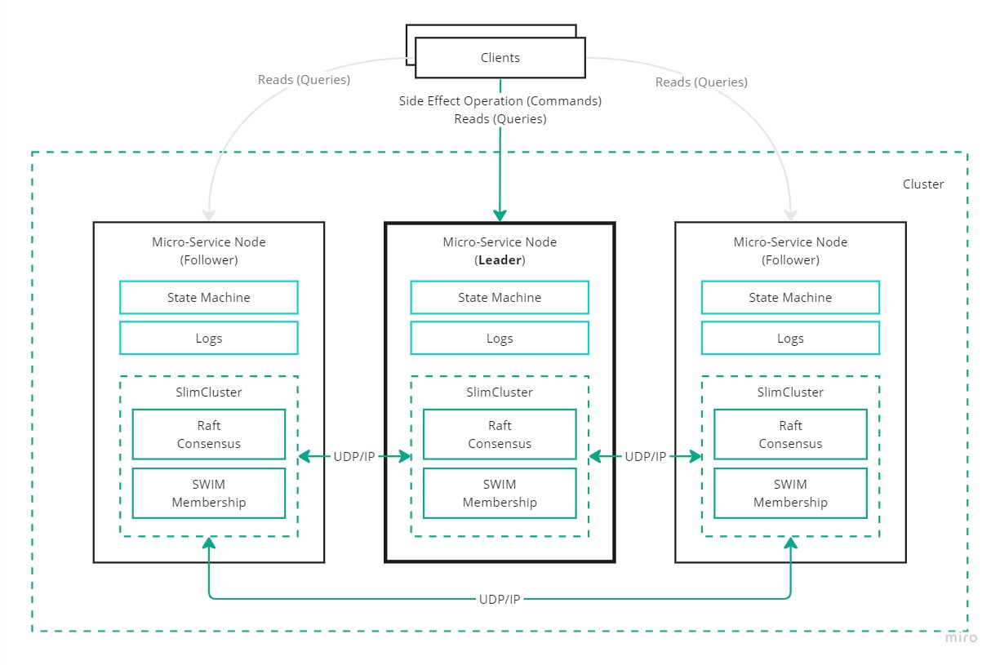

# Introduction to SlimCluster <!-- omit in toc -->

- [About](#about)
- [Configuration](#configuration)
- [Transport](#transport)
  - [IP / UDP Transport](#ip--udp-transport)
- [Serialization](#serialization)
  - [JSON Serialization](#json-serialization)
- [Cluster Persistence](#cluster-persistence)
  - [Local File Persistence](#local-file-persistence)
- [Cluster Membership](#cluster-membership)
  - [SWIM Membership](#swim-membership)
  - [Static Membership](#static-membership)
- [Cluster Consensus](#cluster-consensus)
  - [Raft Consensus](#raft-consensus)
    - [Logs](#logs)
    - [State Machine](#state-machine)
    - [Configuration Parameters](#configuration-parameters)
  - [Leader Request Delegation ASP.NET Core Middleware](#leader-request-delegation-aspnet-core-middleware)

# About

SlimCluster is a library aimed to help with building NET services that need to be clustered (share state and need to coordinate work).
Such clustered services can be hosted in Kubernetes, Azure App Service, AWS, GCP, containers or IaaS - does not matter, as long as the Nodes have access to the same network and IP protocol.

The goal for SlimCluster is to provide all the relevant clustering features, (slim) abstraction over a cluster representation and implement algorithms that you can readily use without having to reimplement it. That way buiding a clustered service becomes easy, and the developer can focus on the business problem at hand.

Think about building the next distributed stream processing system (Flink), database (MongoDb) or messaging system (Kafka) in .NET. All of these have to solve a common problem - the need to know and maintain the cluster members, coordinate work, replicate state and elect the leader for the relevant shard/partition. SlimCluster is there to help with the foundations.

# Configuration

The SlimCluster configuration consists of adding it to the MSDI container using the `services.AddSlimCluster(cfg => {})` method:

```cs
// IServiceCollection services;

services.AddSlimCluster(cfg =>
{
    cfg.ClusterId = "MyCluster";
    // This will use the machine name, in Kubernetes this will be the pod name
    cfg.NodeId = Environment.MachineName;

    // Plugin: Transport will be over UDP/IP
    cfg.AddIpTransport(opts =>
    {
        opts.Port = 60001; // Any available port can be used, this value is default
        opts.MulticastGroupAddress = "239.1.1.1" // Any valid multicast group can be used, this value is default
    });

    // Plugin: Protocol messages (and logs/commands) will be serialized using JSON
    cfg.AddJsonSerialization();

    // Plugin: Cluster state will saved into the local json file in between node restarts
    cfg.AddPersistenceUsingLocalFile("cluster-state.json");

    // Other plugins: membership, consensus, tools
});
```

As part of the configuration we can set:

- What is the ClusterId (logical identifier) and name of the Node.
- What transport will be used (in the above example IP protocol).
- What serialization will be used for the protocol messages (membership, consensus, etc).
- How should the cluster state be persisted in between node instance restarts (this is optional).
- What membership algorithm to use (SWIM).
- What consensus algorithm to use (Raft).
- What other plugins to add.

SlimCluster registers as an `IHostedService` that works with MS Hosting abstraction.
This ensures the cluster starts when any [NET Generic Host](https://learn.microsoft.com/en-us/dotnet/core/extensions/generic-host) compatible runtime starts (ASP.NET Core application).

# Transport

Package: [SlimCluster.Transport](https://www.nuget.org/packages/SlimCluster.Transport)

The transport allows the Nodes in the cluster to exchange protocol messages.

Currently the only possible transport option is IP protocol, where the inter-Node communication happens using UDP sockets.

## IP / UDP Transport

Package: [SlimCluster.Transport.Ip](https://www.nuget.org/packages/SlimCluster.Transport.Ip)

Configures SlimCluster to use the IP/UDP protocol for inter-Node communication.

```cs
cfg.AddIpTransport(opts =>
{
    opts.Port = builder.Configuration.GetValue<int>("UdpPort");
    opts.MulticastGroupAddress = builder.Configuration.GetValue<string>("UdpMulticastGroupAddress")!;
});
```

By design the various plugins that are added to SlimCluster share the same IP port.
The messages are multiplexed into the same Node endpoint, and then routed to the relevant plugin/layer that is able to handle the messages.
Thanks to this SC requires only one port.
In this scenario consensus (Raft) and membership (SWIM) protocol messages go through the same UDP port.



The `MulticastGroupAddress` property allows to set the multicast group used in the initial member discovery.
In the future there will be also option to avoid multicast groups.

# Serialization

Package: [SlimCluster.Serialization](https://www.nuget.org/packages/SlimCluster.Serialization)

Serialization is needed for protocol messages for inter-Node communication.

Currently the only possible serialization option is JSON.
In the near future there are plans to add [ProtoBuf](https://github.com/protocolbuffers/protobuf) binary serialization for performance and payload size optimization.

To write a custom serializer, simply provide and implementation for [ISerializer](../src/SlimCluster.Serialization/ISerializer.cs) in the MSDI container.

## JSON Serialization

Package: [SlimCluster.Serialization.Json](https://www.nuget.org/packages/SlimCluster.Serialization.Json)

```cs
// Plugin: Protocol messages (and logs/commands) will be serialized using JSON
cfg.AddJsonSerialization();
```

# Cluster Persistence

Package: [SlimCluster.Persistence](https://www.nuget.org/packages/SlimCluster.Persistence)

The Node (service instance) needs to persist the minimal cluster state in between instance restarts (or crushes) to quickly catch up with the other Nodes in the cluster.
Depending on the plugins and configuration used, such state might include:

- Last known member list
- Last known leader
- Algorithm state (Raft, SWIM)

While this is not required, it allows the restarted (or crushed) Node to faster catch up with the other members in the Cluster and converge into the correct cluster state.

Currently the only possible option is LocalFile which stores the state in an local JSON file.
In the near future there are plans to add some connectors to Cloud Provider storage offerings (Azure, AWS, GCP).

To write a custom state persitence strategy, simply provide and implementation for [IClusterPersistenceService](../src/SlimCluster.Persistence/IClusterPersistenceService.cs) in the MSDI container.

## Local File Persistence

Package: [SlimCluster.Persistence.LocalFile](https://www.nuget.org/packages/SlimCluster.Persistence.LocalFile)

```cs
// Plugin: Cluster state will saved into the local json file in between node restarts
cfg.AddPersistenceUsingLocalFile("cluster-state.json");
```

# Cluster Membership

Package: [SlimCluster.Membership](https://www.nuget.org/packages/SlimCluster.Membership)

Cluster membership is all about knowing what members (nodes) form the cluster:

- which nodes are alive, healthy, and what is their address (IP/Port),
- running health checks to understand if members are reliable,
- observe members joining or leaving a cluster,
- keeping a list of all the active members.

The [IClusterMembership](../src/SlimCluster.Membership/IClusterMembership.cs) (can be injected) allows to:

- understand the current (self) member information,
- understand what other members form the cluster (Id, Address).

SlimCluster has the [SWIM membership](#swim-membership) algorithm implemented as one of the options.

## SWIM Membership

Package: [SlimCluster.Membership.Swim](https://www.nuget.org/packages/SlimCluster.Membership.Swim)

ToDo

## Static Membership

Package: [SlimCluster.Membership](https://www.nuget.org/packages/SlimCluster.Membership)

If the members of the cluster are known then you do not need to run a membership algorithm:

- The node names (or IP address) are known and fixed,
- Perhaps there is an external framework (or middleware) that tracks the node names (or IP address).

ToDo:

# Cluster Consensus

Package: [SlimCluster.Consensus](https://www.nuget.org/packages/SlimCluster.Consensus)

Consensus allows to coordinate the nodes that form the cluster. It helps to manage a common understanding of reality (cluster state) and replicate that state in case of node failures. Consensus typically requres a node to be designated as the leader that performs the coordination of work and state replication.

## Raft Consensus

Package: [SlimCluster.Consensus.Raft](https://www.nuget.org/packages/SlimCluster.Consensus.Raft)

Raft consensus algorithm is one of the newer algorithms that has become popular due to its simplicity and flexibility.
The [Raft paper](https://raft.github.io/raft.pdf) is an excelent source to undersand more details and about the algorithm parameters that can be fine tuned in SlimCluster.

At a high level the Raft consensus is:

- Storing and replicating logs (Replicated Logs).
- Electing a leader node that is responsible for log replication to follower nodes (Leader Election).
- Leader applies the logs to its own state machine (and followers) when logs have been replicated to the majority of nodes (Replicated State Machine).
- The state machine represents cluster state that is observed by the leader & majority.
- Logs represent commands that mutate cluster state.

From the SlimCluster perspective, the logs (command) and state machione can be anything that is relevant to the application domain problem in question.
This is the part that you have to customize to meet the particular use case (examples further on).

### Logs

ToDo

> Log compaction is not yet supported.

### State Machine

ToDo

### Configuration Parameters

ToDo

## Leader Request Delegation ASP.NET Core Middleware

ToDo
